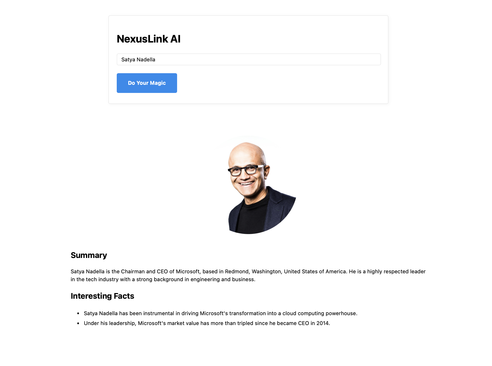

# NexusLink AI: AI-Powered LinkedIn Profile Summarizer

NexusLink AI is a full-stack web application that leverages a multi-step AI agent to automate the process of researching and summarizing professional LinkedIn profiles. Given a person's name, the agent finds their profile, scrapes the relevant data, and uses a Large Language Model (LLM) to generate a concise, professional summary and key facts.



---

## Features

-   **AI-Powered Summarization:** Uses OpenAI's GPT-3.5 to generate summaries from unstructured profile data.
-   **Multi-Step Agentic Workflow:** An intelligent agent first discovers the profile URL and then orchestrates a data processing chain.
-   **Structured Output:** Ensures reliable and validated JSON output from the LLM by binding a Pydantic model directly to the model.
-   **Dynamic Frontend:** A responsive user interface built with vanilla JavaScript that communicates with the backend without page reloads.
-   **RESTful API:** A simple Flask-based API serves as the bridge between the frontend and the backend AI logic.

---

## Tech Stack

-   **Backend:** Python, Flask, LangChain
-   **AI & LLMs:** OpenAI GPT-3.5
-   **Frontend:** HTML, CSS, Vanilla JavaScript (ES6+)
-   **APIs & Tools:**
    -   Tavily API (for search)
    -   Scrapin.io API (for LinkedIn data scraping)
-   **Schema & Parsing:** Pydantic

---

## System Architecture

The application operates on a client-server model:

1.  **Frontend (Client):** The user enters a name into the web interface and submits the form. An asynchronous JavaScript `fetch` call sends a `POST` request to the backend API.
2.  **Backend (Server):** The Flask application receives the request at the `/process` endpoint.
3.  **AI Agent Execution:**
    -   The LangChain agent is triggered.
    -   **Step 1 (Lookup):** The Tavily search tool is used to find the most likely LinkedIn profile URL for the given name.
    -   **Step 2 (Scraping):** The Scrapin.io API is called to scrape the data from the discovered URL.
    -   **Step 3 (Summarization):** The scraped data is passed as context to the OpenAI GPT-3.5 model. The model's output is forced into a Pydantic schema using LangChain's `.with_structured_output()` for reliable JSON.
4.  **Response:** The Flask server sends the final JSON object (containing the summary, facts, and profile picture URL) back to the frontend, which then dynamically updates the page to display the results.

---

## Setup and Installation

Follow these steps to run the project locally.

### 1. Clone the Repository

```bash
git clone https://github.com/Bhavesh-Mankar51/NexusLink-AI.git
cd nexuslinkai
```

### 2. Create a Virtual Environment

It's recommended to use a virtual environment to manage project dependencies.

```bash
# For macOS/Linux
python3 -m venv .venv
source .venv/bin/activate

# For Windows
python -m venv .venv
.\.venv\Scripts\activate
```

### 3. Install Dependencies

Install all the required Python packages from the `requirements.txt` file.

```bash
pip install -r requirements.txt
```

### 4. Set Up Environment Variables

You will need API keys for OpenAI, Tavily, and Scrapin.io.

Create a file named `.env` in the root of the project directory and add your keys in the following format:

```env
OPENAI_API_KEY="sk-..."
TAVILY_API_KEY="tvly-..."
SCRAPIN_API_KEY="..."
```

---

## How to Run

Once the setup is complete, you can start the Flask application with the following command:

```bash
python app.py
```

The application will be available at `http://127.0.0.1:5000`. Open this URL in your web browser to use NexusLink AI.
